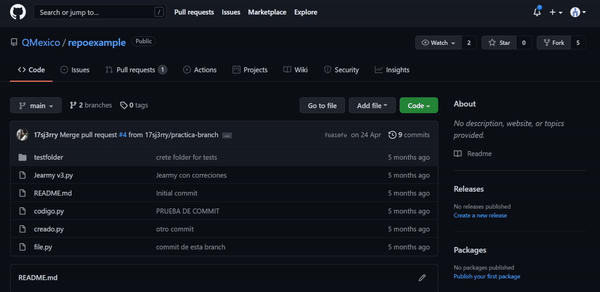
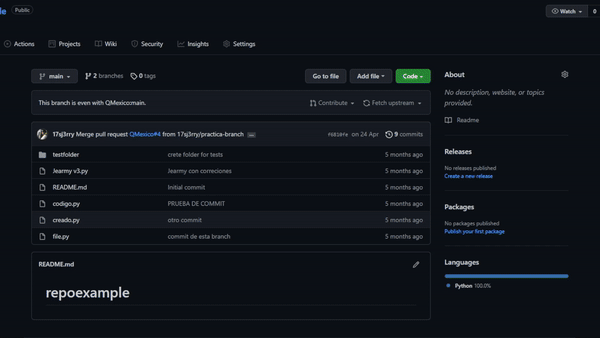
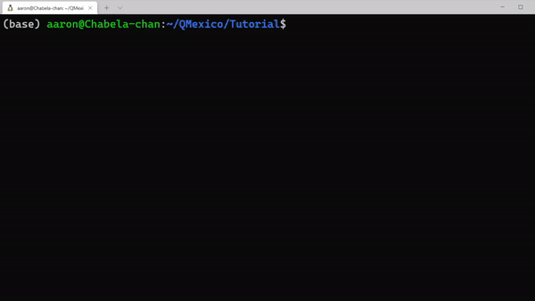
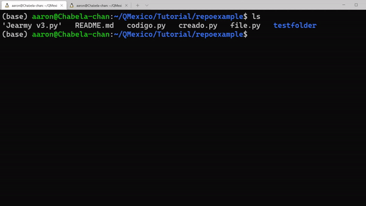
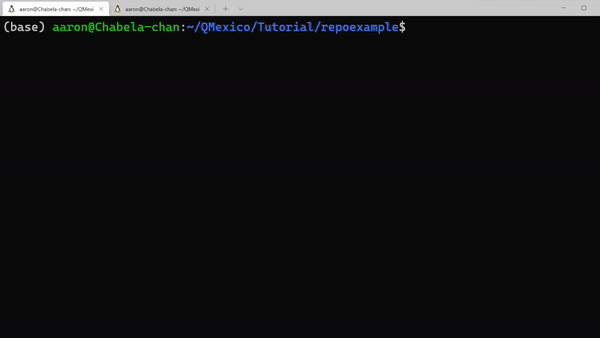
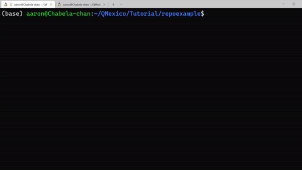
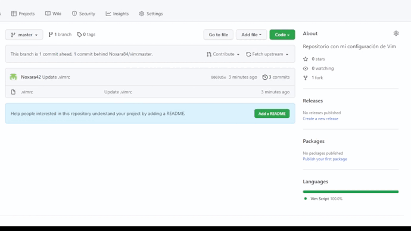

# GitTutorial
GitHub tutorial based on the text of [Clausia](https://github.com/clausia) a founding member of QMexico.

[QMexico GitHub repositories](https://drive.google.com/file/d/1jnLwIjDG05YHltE-tnOwW6poE2f00rkk/view) **In spanish**

# Contribution cycle

The contribution cycle of projects in QNLP is based on the [normal cycle](https://opensource.guide/how-to-contribute/#opening-a-pull-request) of contribution in an open source project, passing for the following points:

<center><h2> Fork -> Clone -> Branch -> Changes -> Add -> Commit -> Push -> PR </h2></center>

# Fork

**Fork** allows you to have your own version of the content.

The easiest way to fork is through the GitHub page, in our test repository we just have to click on the Fork button at the top of the page and we will make a copy of the repository associated with our account.



# Clone

With the **clone** command you get a copy of the remote repository.

With this command we make a copy of the remote files locally, downloading them and allowing us to modify appropriately.

```
git clone path_to_branch
```



# Branch (Optional)

A **branch**, as its name implies, is a ramification of the original repository where changes can be made without affecting the main branch.

A new branch is generated with the command:

```
git checkout -b name_of_branch
```

This creates the branch and moves us to it.

 

# Changes

The branch allows us to make **changes** to the code with our input or proposal.

With the files locally we can make the modifications that we see necessary using out locally tools like conda or jupyter notebook.

The command:

```
git diff
```

It can be useful to us since it shows us all the modifications that we have made with respect to the git clone.

 

# Add

**Add** adds the changes made to our files to the local git index.

The way to report our changes and track them with git is through the command:

```
git add name_of_file
```

Or if we want to add all the moves at once using the path "."

```
git add .
```

 

# Commit

A **commit** is a savestate of changes documented in the Add.

When all the changes that we require are made and it only remains to confirm it, we use the command:

```
git commit
```

What an editor will display to us, to give the obligatory message about the version that we are about to upload or its reduced version.

```
git commit -m "Mensaje para este commit"
```



# Push

The **push** uploads local changes to your GitHub repository.

So what remains is to make an update in our remote repository, we will do this with the command:

```
git push
```

And if it is the first time we make a change, we will use the command

```
git push --set-upstream origin our_branch
```



Once this part is finished, we enter need to merge our changes to original repository.
 
# PR

When the information is uploaded to the QMexico repository, a local selection process is carried out where a section is chosen for our modifications.

